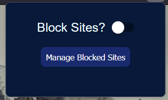
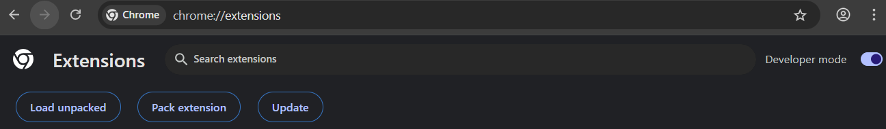
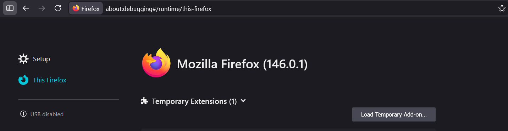
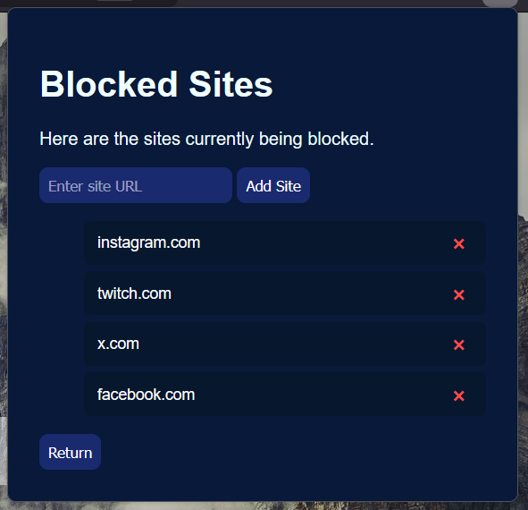

# URLFocus

**URLFocus** is a lightweight browser extension that automatically closes social media tabs when you open them, helping you stay focused by blocking distractions like Facebook, Twitter, and Instagram.



---

## 📂 Files

* Depending 
* **`manifest.json`** — Defines extension metadata, permissions, and the background service worker
* **`background-script.js`** — Contains the logic to detect and close social media tabs.

---

## ✅ Features

* Runs in the background as a service worker.
* Monitors newly opened tabs.
* Closes tabs that match any URLs instantly.
* Easily add and remove sites from your blocked sites list.

---

## ⚙️ Installation Guide

1. Clone or download this repository:

   ```bash
   git clone https://github.com/Taseennn/URLFocus
   cd URLFocus
   ```

2. Open your browser’s extensions page:

   * **Chrome:** `chrome://extensions/`
   * **Firefox:** `about:debugging#/runtime/this-firefox`

3. Enable **Developer Mode** (Chrome)

4. 👉 **Select the correct folder for your browser:**
   * For **Chrome**, choose the `chrome/` subdirectory.   
   * For **Firefox**, choose the `firefox/` subdirectory.


5. Click **Load unpacked** (Chrome) or **Load Temporary Add-on** (Firefox) and select the project folder.




6. Open a social media site — the tab should close automatically.


---

## Manage Blocked Sites

Use the **Manage Blocked Sites** button to easily add or remove sites.

Here’s what the Manage Blocked Sites interface looks like:


---

## 🌐 Supported Sites

* Facebook
* Twitter (X)
* Instagram
* Twitch
* YouTube
* Spotify
* Snapchat
* TikTok
* Reddit
* Any site you add!


## 📄 License

This project is licensed under the MIT License - see the [LICENSE](LICENSE) file for details.

## 🚀 Credits

Created by Taseen
